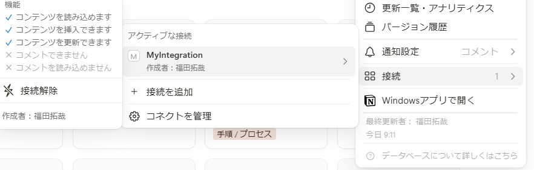

# 概要

ClaudeDesktop や Cursor からではなく自作アプリから MCP サーバを利用する

MCP を用いた RAG 的なところを行いたいのであれば、下記参照  
https://github.com/takuya-fukuda/rag-research

## サンプル ①

Langchain の MCPAdapter を使用して、自身の Desktop を参照する MCP サーバと接続する例

```
import asyncio
import os
from dotenv import load_dotenv

# OpenAIのAPIキーを環境変数や.envから読み込み
load_dotenv()
if "OPENAI_API_KEY" not in os.environ:
    raise EnvironmentError("環境変数 OPENAI_API_KEY が設定されていません")

from langgraph.prebuilt import create_react_agent
from langchain_mcp_adapters.tools import load_mcp_tools
from mcp import ClientSession, StdioServerParameters
from mcp.client.stdio import stdio_client

server_params = StdioServerParameters(
    command="npx",
    args=[
        "-y",
        "@modelcontextprotocol/server-filesystem",
        #"/Users/username/Desktop"
        "/Users/fukuda_takuya/Desktop"
        ],
)

async def main():
    async with stdio_client(server_params) as (read, write):
        async with ClientSession(read, write) as session:
            tools = await load_mcp_tools(session)
            #agent = create_react_agent("anthropic:claude-3-7-sonnet-latest",tools=tools)
            agent = create_react_agent("openai:gpt-4o",tools=tools) #openai
            #response = await agent.invoke({"message": "デスクトップに何がある？"})
            #response = agent.invoke({"messages": [{"role": "user", "content": "デスクトップに何がある？"}]})
            response = await agent.ainvoke({"messages": [{"role": "user", "content": "デスクトップに何がある？"}]})
            print(response)

if __name__ == "__main__":
    asyncio.run(main())

```

## サンプル ② Notion と接続し、Notion 内ナレッジを参照

参考：https://dev.classmethod.jp/articles/notion-mcp-server-guide-with-claude-desktop/

インテグレーションを Notion で作成する。なお仕様上手動で自分のワークスペースにも接続ボタンから許可をしないといけない


スクリプトを実行するカレントディレクトリ上で下記実行（Node.js がインストールされていること）

```
npm install -g @notionhq/notion-mcp-server
```

```
python notion_mcp_adapter_sample.py
```

スクリプトの中身

```
import asyncio
import os
import json
from dotenv import load_dotenv

# OpenAIのAPIキーを環境変数や.envから読み込み
load_dotenv()
if "OPENAI_API_KEY" not in os.environ:
    raise EnvironmentError("環境変数 OPENAI_API_KEY が設定されていません")
notion_token = os.getenv("NOTION_API_TOKEN")

from langgraph.prebuilt import create_react_agent
from langchain_mcp_adapters.tools import load_mcp_tools
from mcp import ClientSession, StdioServerParameters
from mcp.client.stdio import stdio_client

server_params = StdioServerParameters(
    command="npx",
    args=[
        "-y",
        "@notionhq/notion-mcp-server",
        ],
    env={
        "OPENAPI_MCP_HEADERS": "{\"Authorization\": \"Bearer ntn_****\", \"Notion-Version\": \"2022-06-28\" }"
        #"OPENAPI_MCP_HEADERS": json.dumps({"Authorization": f"Bearer {notion_token}","Notion-Version": "2022-06-28"})
    },
)

async def main():
    async with stdio_client(server_params) as (read, write):
        async with ClientSession(read, write) as session:
            tools = await load_mcp_tools(session)
            agent = create_react_agent("openai:gpt-4o",tools=tools) #openai
            response = await agent.ainvoke({"messages": [{"role": "user", "content": "ワークスペースにはどういったナレッジがたまっていますか？"}]})
            print(response)

if __name__ == "__main__":
    asyncio.run(main())

```
